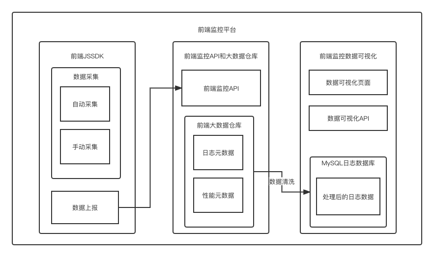

# 前端监控入门

## 前端监控应用场景

- 为什么需要前端监控?
  - 页面的访问行为， PV、UV、IP、PV点击率、UV点击率、停留时长
  - 用户的操作行为，模块曝光、模块点击
  - 页面的性能，首屏渲染时间、API请求时间
  - 异常的监控，JS Error、API异常、业务异常
  - 业务的监控，成交金额、每日消息数 （不重要，后端可做）

- 常见的应用场景
  - 流量分析 
  - 行为分析
  - 性能监控
  - 异常监控

- 常见的前端监控平台有哪些？
  - 百度统计
    - 流量统计和分析 免费
    - 行为分析需要付费
  - 阿里云ARMS
    - 流量分析、性能监控、异常监控
  - 友盟
    - 流量分析
    - 行为分析

- 为什么要选择自建前端监控平台？
  - 如果你的需求主要是流量分析，建议直接使用百度统计或阿里云ARMS
  - 如果你的需求不仅仅是流量分析，还要做行为分析，那么可以考虑自建、
    - 自建成本较高 （人力成本），优势是数据掌握在自己手里
    - 现成平台也有一定的成本（向平台付费），数据是获取不到的
- 希望数据能够储备在自己的数据库里，希望扩展更多的分析维度和能力时，需要自建

## 前端监控平台架构设计

- 前端监控平台的分层
  - 前端监控JSSDK
    - 采集
    - 上报
      - 默认上报：页面PV、性能数据
      - 手动上报：页面操作行为
  - 前端监控API和大数据仓库
    - 上报时候调用，接收上报的数据
    - 数据仓库：MaxCompute
      - 数据存储
      - 数据查询
  -  前端监控数据可视化
    - 日志大数据清洗
    - 大数据回流RDS （将非结构化数据转化为结构化数据）
    - 对结构化数据进行运算和生成图表

	
    
前端监控平台架构图

